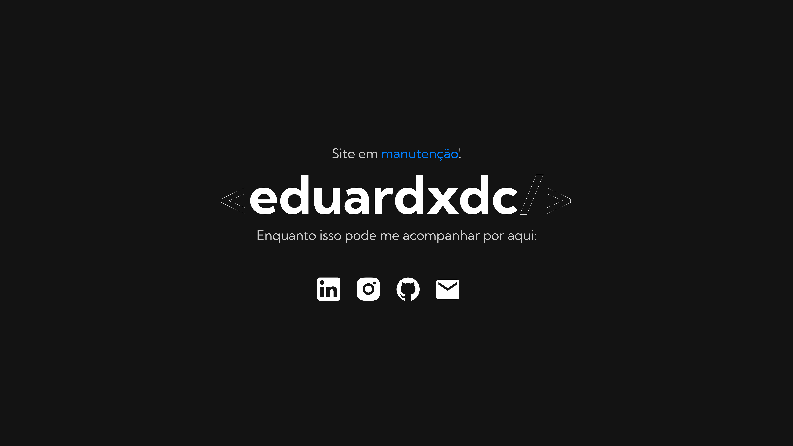

# Portfolio (under maintenance)

## About
Simple page to host my domain with some information from my social networks while I develop the real portfolio website;

## Technologies

Front-End:  

## License
This project is under the MIT license. Check it out here: [LICENSE](./LICENSE)